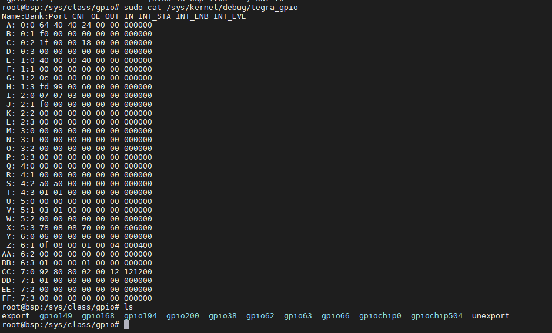
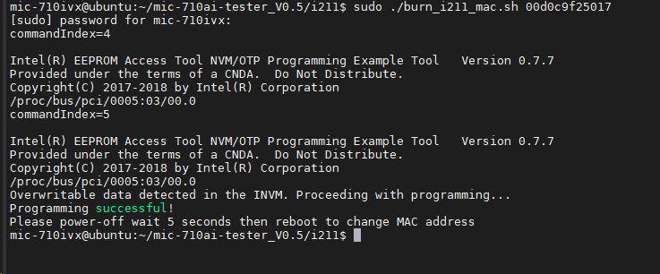
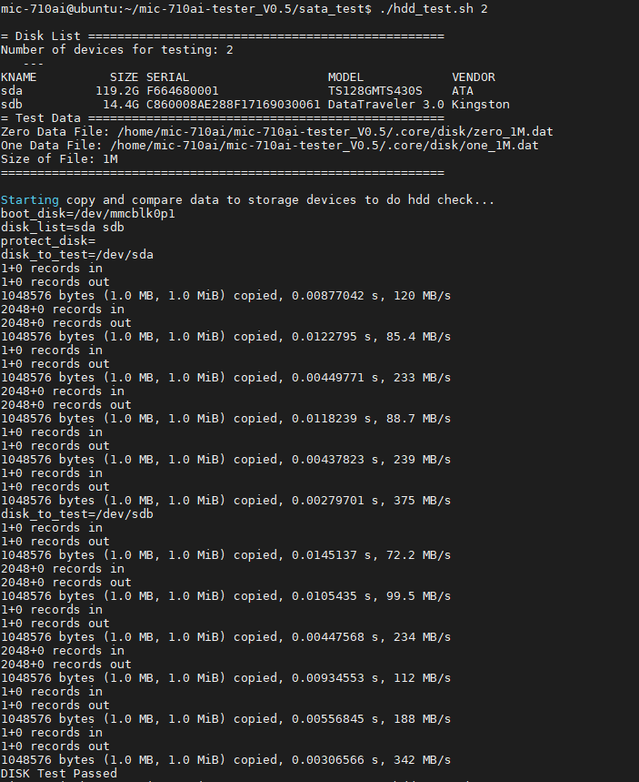
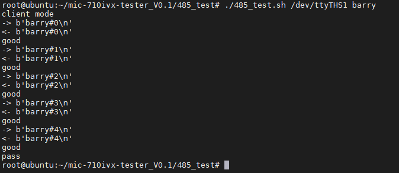
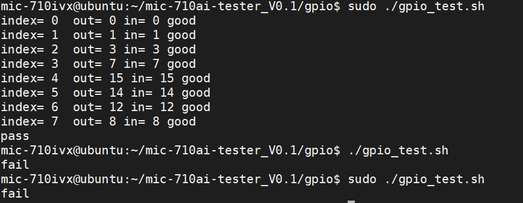

# MIC-710AI IO 產線測試

## Contents
- [產線程式說明](#產線程式說明)
- [GPIO狀態資訊](#GPIO狀態資訊)
- [i210 燒錄步驟改動如下](#i210 燒錄步驟改動如下)
- [i211 ](#i211)
- [hdd](#hdd)
- [usb 2.0 3.0](#usb 2.0 3.0)
- [RS485](#RS485)
- [710ivx-nx gpio](#710ivx-nx gpio)
---

## 產線程式說明

- 485
    - 測試之前COM_SW1的四個Switch全部切成ON，將兩台MIC-710AI對接，一台是NANO另一台是NX
    - 安裝環境 sudo apt-get update && sudo apt-get install -y python3-pip && sudo pip3 install pyserial

- GPIO 
    - 執行 sudo ./gpio_test.sh

- i211 
    - 執行 sudo ./burn_i211_mac.sh 00d0c9f25017

- HDD 
    
    - 在SATA 和 M.2都各連接一個SSD，在ineternl USB連接隨身碟，總共3個裝置
    - 執行 sudo ./hdd test.sh

## GPIO狀態資訊

- sudo cat /sys/kernel/debug/tegra_gpio
- cat /sys/kernel/debug/gpio




* 將腳位寫入
    
    * echo 168 > /sys/class/gpio/export

* 腳位更改狀態，direction: in 、out、hing、low
    
    * echo out > /sys/class/gpio/gpio12/direction
    
    * echo in > /sys/class/gpio/gpio12/direction
    
    * echo low > /sys/class/gpio/gpio12/direction
    
    * echo hing > /sys/class/gpio/gpio12/direction

* value 數值，為 0 或1 
    
    *  echo 0 > /sys/class/gpio/gpio168/value

    *  echo 1 > /sys/class/gpio/gpio168/value


* 查看輸出值
    
    * cat /sys*/class/gpio/gpio168/value

* 取消狀態
    
    * echo 168 > /sys/class/gpio/unexport 


```
#!bin/sh

COUNTER=1
echo 511 > /sys/class/gpio/export
echo out > /sys/class/gpio/it87_gp87/direction
while [ "$COUNTER" -lt 100 ]; do
	echo "gpio test ...:$COUNTER"
	echo 1 > /sys/class/gpio/it87_gp87/value
	sleep 0.3
	echo 0 > /sys/class/gpio/it87_gp87/value
	sleep 0.3
	COUNTER=$(($COUNTER+1))
done
```

* sudo ./gpio.test.sh


## i210 燒錄步驟改動如下

* 先到files server下載下來放到板子上的 /home

* wget http://172.17.8.3:8080/files/advantech/mic-710ai/nano/jetpack-4.3/V1.10/mic-710ai-tester_V0.5.tbz2

* tar -xjf mic-710ai-tester_V0.5.tbz2

* Step 1. sudo ./i210_flash.sh -e
* Step 2. sudo shutdown -P now
* Step 3. Wait 5 seconds, then power on the board.
* Step 4. sudo ./i210_flash.sh -f
* Step 5. sudo shutdown -P now
* Step 6. Wait 5 seconds, then power on the board.
* Step 7. sudo ./i210_flash.sh -m 8a523dcf742b
* Step 8. sudo shutdown -P now
* Step 9. Wait 5 seconds, then power on the board.


* 查看i210有沒有掛上
* lspci 


## i211 

* Step 1. sudo ./burn_i211_mac.sh 00d0c9f25017

* Step 2. sudo shutdown -P now




##  hdd


* ./hdd_test.sh 2

    - 後面輸入數字 設備數目



## usb 2.0 3.0 

* USB2.0孔 插入 usb
    
    - 速度 480m

* USB3.0孔 插入 usb

    - 速度 1000m 


## RS485

* 拿兩台對接rs485，一邊是 server 一邊是client

* 再去查詢 ls /dev/ttyTHS 是哪一個

    - NANO /dev/ttyTHS2

    - NX   /dev/ttyTHS1

* ./485_test.sh /dev/ttyTHS1 HELLO

* ./485_test.sh /dev/ttyTHS2




## 710ivx-nx gpio 

* nx gpio測試程式與其他板子不同

* wget http://172.17.8.3:8080/files/advantech/mic-710ivx/io-test/mic-710ivx-tester_V0.1.tbz2

* wget http://172.17.8.3:8080/files/advantech/mic-710iva/jetpack-4.2.2/outsourcing-david/mic-710iva-tester_V0.1.tbz2

* tar xf mic-710ai-tester_V0.1.tbz2 

* sudo apt-get update 

* sudo apt-get install -y python3 python3-pip

* pip3 install pyserial




## 參考資料

* [Linux下用文件IO的方式操作GPIO（/sys/class/gpio）](https://blog.csdn.net/luckydarcy/article/details/53061901)
